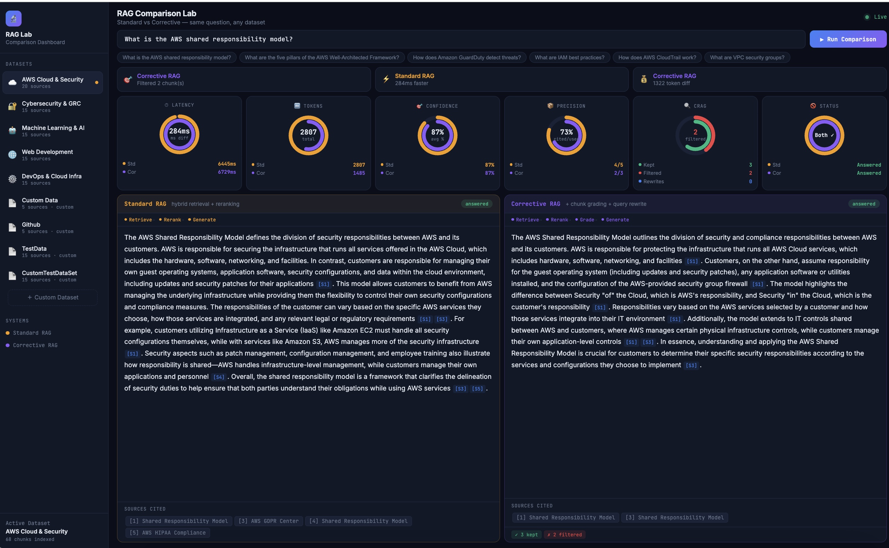

# Ask My Docs — Production RAG System

A domain-specific retrieval-augmented generation system that answers questions grounded in real documentation, with mandatory citations and a live comparison dashboard showing Standard RAG vs Corrective RAG side by side. Built across 4 phases from fundamentals to production-grade evaluation — achieving **0.898 RAGAS faithfulness** across 51 evaluation questions.

---

## Demo



> Standard RAG vs Corrective RAG — same question, same corpus, live metrics

---

## What It Does

You ask a question. The system retrieves relevant document chunks using hybrid search (BM25 + vector), reranks them with a cross-encoder, and generates a cited answer. Every factual claim is backed by a `[Source N]` citation — if the retrieved context doesn't support an answer, the system declines rather than hallucinate.

The comparison dashboard runs both systems simultaneously on the same question so you can see exactly where Corrective RAG's chunk grading and query rewriting make a difference.

---

## Architecture

```
Query
  │
  ├─► BM25 keyword search  ─┐
  │                          ├─► RRF Fusion ─► Cross-Encoder Rerank
  └─► Vector semantic search ┘                        │
                                                       ▼
                                           Corrective RAG (Phase 4)
                                           Grade each chunk individually
                                           Filter bad chunks
                                           Rewrite query if needed
                                                       │
                                                       ▼
                                           Citation-Enforced Generation
                                                       │
                                                       ▼
                                               Cited Answer
```

---

## The 4 Phases

### Phase 1 — Fundamentals
- Scraped and cached 28 real AWS and cybersecurity documentation pages
- Token-aware chunker: 500–800 tokens per chunk, 100-token overlap
- Embedded chunks using `all-MiniLM-L6-v2` into ChromaDB (cosine similarity)
- Basic top-K vector retrieval pipeline with cited answer generation

### Phase 2 — Production Quality
- **Hybrid retrieval:** BM25 keyword search + vector semantic search fused with Reciprocal Rank Fusion (RRF)
- **Cross-encoder reranking:** `ms-marco-MiniLM-L-6-v2` rescores top 20 candidates to a final 5
- **Citation enforcement:** answer is declined if no `[Source N]` citations can be produced
- **Prompt versioning:** all prompts stored and versioned in `config/prompts.yaml`

### Phase 3 — CI-Gated Evaluation
- 50-question golden dataset manually verified across 5 domains (AWS Core, AWS Security, AWS WAF, AWS ML, GRC)
- RAGAS faithfulness evaluation: **0.898 score** on full 51-question dataset
- GitHub Actions CI pipeline — pull requests automatically fail if faithfulness drops below 0.75
- Per-domain and per-difficulty score breakdown with worst-performer reporting

### Phase 4 — Corrective RAG
- **Chunk-level grading:** each of the 5 reranked chunks is graded individually for relevance — bad chunks are filtered out rather than included
- **Query rewriting:** if fewer than 2 chunks pass grading, the system rewrites the query and retries retrieval before declining
- **Live comparison dashboard:** runs Standard RAG and Corrective RAG in parallel on any question, showing latency, tokens, confidence, precision, chunks filtered, and query rewrites side by side
- **Multi-dataset support:** 5 built-in corpora (AWS, Cybersecurity, ML/AI, Web Dev, DevOps) plus custom URL ingestion

---

## Evaluation Results

| Metric | Score |
|---|---|
| Overall faithfulness | **0.898** |
| aws_core | 0.955 |
| aws_ml | 0.950 |
| aws_security | 0.907 |
| grc | 0.856 |
| Questions evaluated | 51 |
| Declined (correct refusals) | 6 |
| CI threshold | 0.75 |

Faithfulness measures whether every claim in a generated answer is actually supported by the retrieved chunks — scored by RAGAS using GPT-4o-mini as the judge.

---

## Tech Stack

| Layer | Tool |
|---|---|
| Embeddings | `sentence-transformers/all-MiniLM-L6-v2` |
| Vector store | ChromaDB (persistent, cosine similarity) |
| Keyword search | BM25Okapi via `rank-bm25` |
| Reranker | `cross-encoder/ms-marco-MiniLM-L-6-v2` |
| LLM | OpenAI GPT-4o-mini |
| Evaluation | RAGAS faithfulness metric |
| Backend | FastAPI + uvicorn |
| CI/CD | GitHub Actions |

---

## Project Structure

```
rag-app/
├── app.py                    # Single-query UI backend
├── app_compare.py            # Comparison dashboard backend
├── ingest.py                 # Corpus ingestion CLI
├── ask.py                    # Terminal query CLI
├── config/
│   └── prompts.yaml          # Versioned prompt store (v2.0.0)
├── src/
│   ├── ingestion/
│   │   ├── corpus_fetcher.py # Fetches and caches documents
│   │   ├── chunker.py        # Token-aware overlap chunker
│   │   └── datasets.py       # Multi-dataset registry
│   ├── retrieval/
│   │   ├── vector_store.py   # ChromaDB wrapper
│   │   ├── bm25_index.py     # BM25 keyword index
│   │   └── hybrid_retriever.py # RRF fusion (parallel)
│   ├── reranking/
│   │   └── reranker.py       # Cross-encoder reranker
│   ├── generation/
│   │   └── generator.py      # Citation-enforced LLM generation
│   ├── corrective/
│   │   └── corrective_rag.py # Phase 4: chunk grading + query rewriting
│   └── pipeline.py           # Orchestrates all components
├── ui/
│   ├── index.html            # Single-query UI
│   └── compare.html          # Comparison dashboard
├── tests/
│   ├── test_core.py          # Chunker, BM25, RRF tests (no API)
│   ├── test_eval.py          # Golden dataset schema tests
│   └── test_corrective_rag.py # Corrective RAG unit tests
├── scripts/
│   └── eval.py               # Offline RAGAS evaluation script
└── evaluation/
    └── golden_dataset.json   # 50 manually verified Q&A pairs
```

---

## Setup & Running

### 1. Clone and install

```bash
git clone https://github.com/arao510/ask-my-docs.git
cd ask-my-docs
pip3 install -r requirements.txt
```

### 2. Set your OpenAI API key

Create a `.env` file in the project root:

```
OPENAI_API_KEY=sk-your-key-here
```

### 3. Ingest the default corpus

```bash
python3 ingest.py
```

This fetches 28 AWS and cybersecurity documentation pages, chunks them, embeds them into ChromaDB, and builds the BM25 index. Takes 2–3 minutes on first run, subsequent runs use the cache.

### 4. Run the apps

**Single-query UI** (http://localhost:8000):
```bash
python3 -m uvicorn app:app --host 0.0.0.0 --port 8000 --reload
```

**Comparison dashboard** (http://localhost:8001):
```bash
python3 -m uvicorn app_compare:app --host 0.0.0.0 --port 8001 --reload
```

**Terminal query:**
```bash
python3 ask.py "What is the AWS shared responsibility model?"
python3 ask.py --interactive
```

### 5. Run the evaluation

```bash
# Quick sample (10 questions, ~$0.05)
python3 scripts/eval.py --sample 10

# Full 51-question evaluation
python3 scripts/eval.py

# Filter by domain
python3 scripts/eval.py --domain aws_security
```

### 6. Run the tests

```bash
python3 -m pytest tests/ -v
```

All 37 tests run without an API key.

---

## Using Custom Datasets

The comparison dashboard supports any publicly accessible documentation. Click **＋ Custom Dataset** in the sidebar, paste URLs (up to 30), and the system fetches, chunks, and indexes them in real time.

**Confirmed working sources:**
```
https://docs.python.org/3/tutorial/introduction.html
https://docs.python.org/3/tutorial/datastructures.html
https://en.wikipedia.org/wiki/Retrieval-augmented_generation
https://en.wikipedia.org/wiki/Docker_(software)
https://developer.mozilla.org/en-US/docs/Web/API/Fetch_API/Using_Fetch
https://fastapi.tiangolo.com/
```

---

## How Citation Enforcement Works

The system enforces two layers of grounding:

1. **Relevance gate** — uses the cross-encoder rerank score to determine if retrieved context supports the question before generating. Low-scoring batches are declined immediately.

2. **Citation count validation** — after generation, the code counts `[Source N]` references in the answer. Zero citations → automatic decline. The answer is only returned if every claim is traceable to a specific chunk.

This means the system will correctly refuse to answer questions where the corpus doesn't have supporting information, rather than hallucinating a confident-sounding response.

---

## Built By

**Asaveri Rao** — [linkedin.com/in/asaveri-rao](https://linkedin.com/in/asaveri-rao) · [github.com/arao510](https://github.com/arao510)

UC Santa Cruz, B.S. Computer Science · Cybersecurity Intern @ SmarterD · Front-End Engineering Intern @ Enterprise Ethereum Alliance